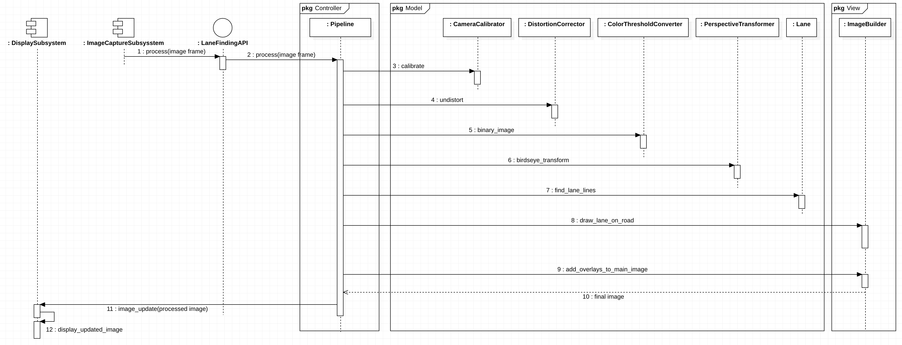

# Advanced Lane Finding

This project is part of [Udacity](https://www.udacity.com)'s [Self-driving Car Engineer Nanodegree](https://www.udacity.com/course/self-driving-car-engineer-nanodegree--nd013) program. The goal of this proejct is to write a software pipeline to identify the lane boundaries in a video. 

# Contents
* [Project goals](#Project-goals)
* [Solution overview](#Solution-overview)
* [Software design](#Software-design)
* [Pipeline summary](#Pipeline-summary)
* [Camera calibration](#Camera-calibration)
* [The Pipeline](#The-pipeline)
  * [Distortion correction](#Distortion-correction)
  * [Thresholded binary image](#Thresholded-binary-image)
  * [Perspective transform](#Perspective-transform)
  * [Identify lane pixels](#Identify-lane-pixels)
  * [Radius of curvature and vehicle position](#Radius-of-curvature-and-vehicle-position)
  * [Plotting lane back onto the road](#Plotting-lane-back-onto-the-road)
  * [Final output image](#Final-output-image)
  * [Additional examples](#Additional-examples)
* [Pipeline video](#Pipeline-video)
  * [Project video](#Project-video)
  * [Optional challenge videos](#Optional-challenge-videos)
    * [Challenge video](#Challenge-video)
    * [Harder challenge video](#Harder-challenge-video)
* [Discussion](#Discussion)
* [References](#References)


# Project goals

The goals of this project are the following:

* Compute the camera calibration matrix and distortion coefficients given a set of chessboard images.
* Apply a distortion correction to raw images.
* Use color transforms, gradients, etc., to create a thresholded binary image.
* Apply a perspective transform to rectify binary image ("birds-eye view").
* Detect lane pixels and fit to find the lane boundary.
* Determine the curvature of the lane and vehicle position with respect to center.
* Warp the detected lane boundaries back onto the original image.
* Output visual display of the lane boundaries and numerical estimation of lane curvature and vehicle position.


# Solution overview
The code is in a module called `lane_finding` which is in the [lane_finding](lane_finding) directory. 

There are two files that execute the `lane_finding` module:
* [process_images.py](process_images.py) executes the `lane_finding` module and runs the set of test images through the image processing pipeline.
* [process_video.py](process_video.py) executes the `lane_finding` module and runs the three test videos through the image processing pipeline.

# Software design
The design of the lane finding module follows a basic Model-View-Controller pattern. This directory layout reflects this pattern, with each part in its own sub-directory:
```text
lane_finding/
  |
  |-- model/
     |-- camera_calibrator
     |-- distortion_corrector
     |-- color_threshold_converter
     |-- perspective_transformer
     |-- lane
     |-- line
  |-- view/
     |-- image_builder
     |-- image_plotter
  |-- controller/
     |-- pipeline
     |-- hyperparameters
  |-- config/
     |-- config_data
```

* [Model](lane_finding/model) contains the core domain abstractions. 
  * camera calibration ([CameraCalibrator](lane_finding/model/camera_calibrator.py))
  * distortion correction ([DistortionCorrector](lane_finding/model/distortion_corrector.py))
  * color thresholding ([ColorThresholdConverter](lane_finding/model/color_threshold_converter.py))
  * perspective transformation([PerspectiveTransformer](lane_finding/model/perspective_transformer.py))
  * lanes ([Lane](lane_finding/model/lane.py))
  * lane lines ([Line](lane_finding/model/line.py))
* [View](lane_finding/view) contains two classes that manage the presentation logic. 
  * [ImagePlotter](lane_finding/view/image_plotter.py) takes care of plotting images - I use this for testing and for creating documentation. It provides a number of utility functions for plotting various image combinations.
  * [ImageBuilder](lane_finding/view/image_builder.py) is that class that builds the final output image with the lane highlihgted on the road. This class manages the overlay of inset images and text on the main image. 
* [Controller](lane_finding/controller) controls the flow of execition. 
  * The [Pipeline](lane_finding/controller/pipeline.py) class implements a classic pipeline architecture, and chains together the inputs and outputs of the various model elements to process images through the pipeline.
  * The [HyperParameters](lane_finding/controller/hyperparameters.py) class. [HyperParameters](lane_finding/controller/hyperparameters.py) contains parameters that allow us to tune the image processing pipeline for different scenarios. For example, I use the same pipeline code on all three videos for this project, but tune the hyperparameters differently for each video. Examples [are shown below](#Project-video).


# Pipeline summary

This sequence diagram is a visual representation of how the pipeline processes a raw image frame:



The camera calibration matrix and distortion coefficients are computed when the pipeline is initialized. 
```python
# Calibrate the camera when the pipeline is first created
self.camera_matrix, self.distortion_coefficients = self.camera_calibrator.calibrate()
```

The `process()` function in the [Pipeline](lane_finding/controller/pipeline.py) class is the main controller for executing the pipeline.

```python
# STEP 1. Undistort the image using the coefficients found in camera calibration
undistorted_image = self.distortion_corrector.undistort(image, self.camera_matrix, self.distortion_coefficients)

# STEP 2. Apply thresholds to create a binary image, getting the binary image to highlight the lane lines as
# much as possible
binary_image = self.threshold_converter.binary_image(undistorted_image, self.hyperparameters)

# STEP 3. Apply a perspective transform to obtain bird's eye view
birdseye_image, M, Minv = self.perspective_transformer.birdseye_transform(binary_image)

# STEP 4. Find the lane lines
self.left_fitx, self.right_fitx, self.ploty, birdseye_with_lane_lines = self.lane.find_lane_lines(
    birdseye_image,
    self.lane,
    self.hyperparameters.image_frame_number)

# STEP 5. Draw the lane lines area back onto the original image
image_with_detected_lane = self.image_builder.draw_lane_on_road(undistorted_image,
                                                                Minv,
                                                                self.lane.left_line,
                                                                self.lane.right_line,
                                                                keep_state=self.hyperparameters.keep_state)

```
Next, the pipeline adds the radius, vehicle position, and inset pipeline images to the main image. 
```python
# STEP 6. Add inset images and text to the main image
self.calculate_lane_metrics(birdseye_image.shape[0], birdseye_image.shape[1])

# Add metrics and images from different pipeline steps as insets overlaid on the main image
final_image = self.image_builder.add_overlays_to_main_image(image_with_detected_lane,
                                                            binary_image,
                                                            birdseye_image,
                                                            birdseye_with_lane_lines,
                                                            undistorted_image,
                                                            self.radius_of_curvature_metres,
                                                            self.offset_in_meters,
                                                            str(self.offset_position),
                                                            self.hyperparameters.image_frame_number)
```

# Camera calibration
Compute the camera calibration matrix and distortion coefficients given a set of chessboard images.

Udacity provided two sets of images for testing. The folder called [camera_cal](data/camera_cal) contains the images for camera calibration.  The images in [test_images](data/test_images) are for testing the pipeline on single frames.  

In addition to these I created my own set of images for testing by saving image frames of the test videos.
* The [test_pipeline_images](data/test_pipeline_images) contains the images I generated for testing. 
* For each frame, there is an undistorted image, binary image, birdseye transform image, birdseye transform with highlihgted lanes, and an image that shows the lane projected onto the road surface.
* The [images_from_project_video](data/test_pipeline_images/images_from_project_video) contains a set of images captured from specific frames of my output video. In addition to images for all of the intermediate pipeline steps, there are images for the original input frame and the finale combined result image frame.  


```python
class Pipeline:
    def __init__(self, calibration_images_dir, hyperparameters, debug_pipeline_images=False):
        ...
        self.camera_calibrator = CameraCalibrator(self.CALIBRATION_IMAGES_DIR)
        ...
        # Calibrate the camera when the pipeline is first created
        self.camera_matrix, self.distortion_coefficients = self.camera_calibrator.calibrate()
        ...
```

The code to calibrate the camera is in the [CameraCalibrator](lane_finding/model/camera_calibrator.py) class. The constructor sets up the calibration parameters and determines the image points and object points required to calibrate the camera. The [CameraCalibrator.calibrate()](lane_finding/model/camera_calibrator.py#calibrate) function manages the calibration and returns the camera matrix and distortion coefficients that will be used in the image processing pipeline.
```python
class CameraCalibrator:

    def __init__(self, calibration_images_dir, chessboard_width=9, chessboard_height=6):
        self.calibration_images_dir = calibration_images_dir
        self.chessboard_height = chessboard_height
        self.chessboard_width = chessboard_width
        self.is_calibrated = False
        self.ret = None
        self.rotation_vectors = None
        self.translation_vectors = None
        self.image_points, self.object_points, self.img_size = self._get_calibration_parameters()

    def calibrate(self):
        """
        Calibrate the camera.
        :return: the camera matrix and distortion coefficients.
        """

        self.ret, camera_matrix, distortion_coefficients, self.rotation_vectors, self.translation_vectors = cv2.calibrateCamera(
            self.object_points,
            self.image_points,
            self.img_size,
            None,
            None)

        self.is_calibrated = True

        return camera_matrix, distortion_coefficients

```
The full source code for the [CameraCalibrator](lane_finding/model/camera_calibrator.py) is in the file [camera_calibrator.py](lane_finding/model/camera_calibrator.py).


# The Pipeline

## Distortion correction
The first step in the pipeline is use the camera matrix and distortion coefficients obtained when calibrating the camerea, and use these to apply a distortion correction to the incoming raw image. 

This is the relevant line of code from the [Pipeline](lane_finding/controller/pipeline.py) `process()` function:
```python
# STEP 1. Undistort the image using the coefficients found in camera calibration
undistorted_image = self.distortion_corrector.undistort(image, self.camera_matrix, self.distortion_coefficients)
```
The original raw image and the resulting undistorted image are shown here:

Original Image | Undistorted Image
--- | ---
 |  

The code that performs the distortion correction is in the [DistortionCorrector](lane_finding/model/distortion_corrector.py) class:

```python
class DistortionCorrector:
    """
    Encapsulate the process of undistorting images.
    """

    def undistort(self, image, camera_matrix, distortion_coefficients):
        """
        Perform image distortion correction and return the undistorted image.

        :param image: the original image captured by the camera
        :param camera_matrix: the camera matrix created when calibrating the camera
        :param distortion_coefficients: the distortion coefficients created when calibrating the camera

        :return an undistorted version of the input image
        """
        undistorted_image = cv2.undistort(image,
                                          camera_matrix,
                                          distortion_coefficients,
                                          None,
                                          newCameraMatrix=camera_matrix)

        return undistorted_image
```


Note that three of the images appear empty in the results because not all internal corners are visible in their respective input images. This refers specifically to images 1, 4, and 5 from the test calibration image set, as shown here:

image 1 | image 4 | image 5
:--- | :--- | :---
 |  | 

Some additional examples of calibrated chessboard images are shown here:


These next examples show road images before and after calibration:


The sections below show many more examples of calibrated images moving through the pipeline.

## Thresholded binary image
The next step in the pipeline uses color transforms, gradients, etc., to create a thresholded binary image.

This is the relevant line of code from the [Pipeline](lane_finding/controller/pipeline.py) `process()` function:
```python
# STEP 2. Apply thresholds to create a binary image, getting the binary image to highlight the lane lines as
# much as possible
binary_image = self.threshold_converter.binary_image(undistorted_image, self.hyperparameters)
```

Undistorted Image | Thresholded Binary Image
--- | ---
 |  


The code that performs the conversion from the undistorted image to a binary image is in the [ColorThresholdConverter](lane_finding/model/color_threshold_converter.py) class. The `binary_image()` function is the primary entry point that returns the binary image. It serves as a simple facade that delegates to the `convert_to_binary()` function. 

```python
def binary_image(self, img, hyperparameters):
    """
    Serve as a facade so I can select different pipelines

    :param img: undistorted color image
    :return: binary image
    """
    sxbinary, s_binary, color_binary, combined_binary = self.convert_to_binary(img, hyperparameters)

    # The current implementation of the main pipeline just needs one binary image
    return combined_binary

def convert_to_binary(self, img, hyperparameters):
    img = np.copy(img)

    # Convert to HLS color space and separate the V channel
    hls = cv2.cvtColor(img, cv2.COLOR_RGB2HLS)
    l_channel = self.HLS().l_channel(hls)
    s_channel = self.HLS().s_channel(hls)

    # Sobel x
    kernel_size = hyperparameters.thresholding().sobel_kernel_size()
    sobelx = cv2.Sobel(l_channel, cv2.CV_64F, 1, 0, ksize=kernel_size)  # Take the derivative in x
    abs_sobelx = np.absolute(sobelx)  # Absolute x derivative to accentuate lines away from horizontal
    scaled_sobel = np.uint8(255 * abs_sobelx / np.max(abs_sobelx))

    # Threshold x gradient
    thresh_min = hyperparameters.thresholding().sobelx_threshold()[0]
    thresh_max = hyperparameters.thresholding().sobelx_threshold()[1]
    sxbinary = np.zeros_like(scaled_sobel)
    sxbinary[(scaled_sobel >= thresh_min) & (scaled_sobel <= thresh_max)] = 1

    # Threshold color channel
    s_thresh_min = hyperparameters.thresholding().sobel_threshold()[0]
    s_thresh_max = hyperparameters.thresholding().sobel_threshold()[1]
    s_binary = self.HLS().s_binary(s_channel, thresh=(s_thresh_min, s_thresh_max))

    # Stack each channel to view their individual contributions in green and blue respectively
    # This returns a stack of the two binary images, whose components you can see as different colors
    color_binary = np.dstack((np.zeros_like(sxbinary), sxbinary, s_binary)) * 255

    # Combine the two binary thresholds
    combined_binary = np.zeros_like(sxbinary)
    combined_binary[(s_binary == 1) | (sxbinary == 1)] = 1

    return sxbinary, s_binary, color_binary, combined_binary
```

## Perspective transform
The next step in the pipeline applies a perspective transform to rectify binary image ("birds-eye view").

This is the relevant line of code from the [Pipeline](lane_finding/controller/pipeline.py) `process()` function:
```python
# STEP 3. Apply a perspective transform to obtain bird's eye view
birdseye_image, M, Minv = self.perspective_transformer.birdseye_transform(binary_image)
```

Thresholded Binary Image | Perspective Transform
--- | ---
 |  

The code that implements the transform is in the [PerspectiveTransformer](lane_finding/model/perspective_transformer.py) class, shown here:

```python
class PerspectiveTransformer:

    def birdseye_transform(self, image):
        """
        Apply perspective transform to input frame to get the bird's eye view.
        :return: warped image, and both forward and backward transformation matrices
        """
        h, w = image.shape[:2]

        src = np.float32([[w, h - 10],  # br
                          [0, h - 10],  # bl
                          [546, 460],  # tl
                          [732, 460]])  # tr

        dst = np.float32([[w, h],  # br
                          [0, h],  # bl
                          [0, 0],  # tl
                          [w, 0]])  # tr

        # calculate the perspective transform, M
        M = cv2.getPerspectiveTransform(src, dst)

        # Calculate the inverse
        Minv = cv2.getPerspectiveTransform(dst, src)

        # Create warped image - uses linear interpolation
        warped = cv2.warpPerspective(image, M, (w, h), flags=cv2.INTER_LINEAR)

        return warped, M, Minv
```

## Identify lane pixels
The next step in the pipeline detects lane pixels and fit to find the lane boundary.

This is the relevant line of code from the [Pipeline](lane_finding/controller/pipeline.py) `process()` function:
```python
# STEP 4. Find the lane lines
self.left_fitx, self.right_fitx, self.ploty, birdseye_with_lane_lines = self.lane.find_lane_lines(
    birdseye_image,
    self.lane,
    self.hyperparameters.image_frame_number)
```

Perspective Transform | Lane Boundary
--- | ---
  |  

The entry point for finding the lane lines is in the [Lane](lane_finding/model/lane.py) class's `find_lane_lines()` function, shown here:
```python
def find_lane_lines(self,
                    birdseye_binary,
                    prev_lane,
                    image_frame_num=0):

    if image_frame_num == 0 and self.hyperparameters.reset_lane_search is True:
        return self.get_polynomial_coeffs_using_sliding_window(
            birdseye_binary,
            prev_lane)
    else:
        self.hyperparameters.reset_lane_search = False
        return self.get_polynomial_coeffs_using_previous_laneline_position(
            birdseye_binary,
            prev_lane)
```

The function delegates to the `get_polynomial_coeffs_using_sliding_window()` function for the first frame in a video pipeline, and to the `get_polynomial_coeffs_using_previous_laneline_position()` function for the second and subsequent frames. If we lose track of the pixels, e.g., due to poor lighting or other conditions, we reset and go back to searching for the lane lines using the sliding window function.

## Radius of curvature and vehicle position
We also need to determine the curvature of the lane and vehicle position with respect to center.

The radius of curvature of a lane line is calculated in the [Line](lane_finding/model/line.py) class:
```python
def radius_of_curvature(self, coeffs, ploty):
    """
    Radius of curve = ( (1 + (2Ay + B)^2)^(3/2) ) / |2A|

    :param coeffs: polynomial coefficients
    :param ploty: y parameters for plotting
    :return: radius
    """
    A = coeffs[0]
    B = coeffs[1]
    y = np.max(ploty) * self.hyperparameters.lane().metres_per_pixel_y

    r_curve = ((1 + (2 * A * y + B) ** 2) ** (3 / 2)) / np.absolute(2 * A)
    return r_curve
```

The vehicle offset and position is calculated in the [Lane](lane_finding/model/lane.py) class:
```python
def offset_and_position(self,
                        img_h,
                        img_w):
    """
    Compute offset from center of the inferred lane. The offset from the lane center can be computed under the
    hypothesis that the camera is fixed and mounted in the midpoint of the car roof. In this case, we can
    approximate the car's deviation from the lane center as the distance between the center of the image and the
    midpoint at the bottom of the image of the two lane-lines detected.

    :param img_h: the height of the birdseye image
    :param img_w: the width of the birdseye image
    :return: offset ond position of the vehicle, relative to the center of the lane
    """
    # Vehicle position with respect to camera mounted at the center of the car
    vehicle_position = img_w / 2

    left_fit = self.left_line.current_fit_coeffs
    right_fit = self.right_line.current_fit_coeffs

    # Calculate x-intercept for the left and right polynomial
    left_fit_x_int = left_fit[0] * img_h ** 2 + left_fit[1] * img_h + left_fit[2]
    right_fit_x_int = right_fit[0] * img_h ** 2 + right_fit[1] * img_h + right_fit[2]

    # Calculate lane center position from x-intercepts
    lane_center_position = (left_fit_x_int + right_fit_x_int) / 2

    offset = np.abs(vehicle_position - lane_center_position) * self.hyperparameters.lane().metres_per_pixel_x

    # Check if vehicle's position is left or right of center of the lane
    if lane_center_position == vehicle_position:
        position = "center"
    elif lane_center_position > vehicle_position:
        position = "left"
    else:
        position = "right"

    return offset, position
```

The final output image displays these calculations. Visual examples are shown below, and can also be seen in the output videos.

## Plotting lane back onto the road
The next step in the pipeline warps the detected lane boundaries back onto the original image.

This is the relevant line of code from the [Pipeline](lane_finding/controller/pipeline.py) `process()` function:
```python
# STEP 5. Draw the lane lines area back onto the original image
image_with_detected_lane = self.image_builder.draw_lane_on_road(undistorted_image,
                                                                Minv,
                                                                self.lane.left_line,
                                                                self.lane.right_line,
                                                                keep_state=self.hyperparameters.keep_state)
```

Undistorted Image | Lane on Road Image
--- | ---
 |  

The [ImageBuilder](lane_finding/view/image_builder.py) class contains the code that implements this.

## Final output image
The final step in the pipeline creates the final output image, and displays the radius of curvature and the vehicle position and offset. I also opted to include intermediate pipeline images as insets/overlays, and also the frame number.

This is the relevant line of code from the [Pipeline](lane_finding/controller/pipeline.py) `process()` function:
```python
# Add metrics and images from different pipeline steps as insets overlaid on the main image
final_image = self.image_builder.add_overlays_to_main_image(image_with_detected_lane,
                                                            binary_image,
                                                            birdseye_image,
                                                            birdseye_with_lane_lines,
                                                            undistorted_image,
                                                            self.radius_of_curvature_metres,
                                                            self.offset_in_meters,
                                                            str(self.offset_position),
                                                            self.hyperparameters.image_frame_number)
```


The [ImageBuilder](lane_finding/view/image_builder.py) class contains the code that implements this.

## Additional examples
Here are some more examples of final image frames from my project video output. I chose these to show specific interesting points during the video. 

### Frame 111
**Scenario**: Long stretch of relatively straight road with a bend up ahead to the left.


### Frame 314
**Scenario**: Long stretch of relatively straight road with a car passing on the right.


### Frame 553
**Scenario**: Passing through an area of road with a lot of bright light causing glare on the road, and making it harder to see the lane lines.


### Frame 607
**Scenario**: Transitioning from an area of road with a lot of bright light causing glare on the road, back to more favorable lighting conditions, and bending to the right up ahead.


# Pipeline video
The video pipeline outputs a visual display of the lane boundaries and numerical estimation of lane curvature and vehicle position. The file [process_video.py](process_video.py) contains the code that exectures the pipeline for each of the three test videos provided. 


## Project video

The input video is [here](data/test_videos/project_video.mp4). The output video is [here](output_videos/out_project_video.mp4):

The code to run this video through the pipeline is in the `PipelineVideoTests` class in the [process_video.py](process_video.py) file.
```python
def test_project_video(self):
    params = Hyperparameters()

    pipeline = Pipeline(CALIBRATION_IMAGES_DIR, params, debug_pipeline_images=self.debug_images)
    video_name = 'project_video.mp4'
    video_file_path = TEST_VIDEOS_DIR + '/' + video_name

    clip = VideoFileClip(video_file_path).fl_image(pipeline.process)
    clip.write_videofile(VIDEO_OUTPUT_FILE_BASE_PATH + video_name, audio=self.enable_audio)
```

I tuned the hyperparameters to optimize for the primary project video. Their default values work well for this video, so there is not need to explicitly set them 

You can watch the output of the pipeline applied to the project video on YouTube:
[](https://youtu.be/kzYbIra3nH8 "Project video")


## Optional challenge videos

The [challenge_video.mp4](data/test_videos/challenge_video.mp4) video is an extra (and optional) challenge to test the pipeline under somewhat trickier conditions.  The [harder_challenge.mp4](data/test_videos/harder_challenge_video.mp4) video is another optional challenge and is brutal!


### Challenge video

The input video is [here](data/test_videos/challenge_video.mp4). The output video is [here](output_videos/out_challenge_video.mp4):


You can watch the output of the pipeline applied to the challenge video on YouTube:
[](https://youtu.be/M7CPvri28hE "Challenge video")

The code to run this video through the pipeline is in the `PipelineVideoTests` class in the [process_video.py](process_video.py) file. Here you can see the hyperparameter values I set for this video.
```python
def test_challenge_video(self):
    params = Hyperparameters()
    params.lane().set_meters_per_pixel_y(20, 700)
    params.lane().set_meters_per_pixel_x(3.2, 675)
    params.lane().set_margin_first_frame(100)
    params.lane().set_margin_second_frame(80)
    params.lane().set_num_windows(35)
    params.lane().set_lane_projection_width(350, 710)
    params.lane().set_poly_fit_val(300)
    params.thresholding().set_sobel_threshold(130, 250)
    params.thresholding().set_sobelx_threshold(10, 150)
    params.thresholding().set_sobel_kernel_size(5)

    pipeline = Pipeline(CALIBRATION_IMAGES_DIR, params, debug_pipeline_images=self.debug_images)
    video_name = 'challenge_video.mp4'
    video_file_path = TEST_VIDEOS_DIR + '/' + video_name

    clip = VideoFileClip(video_file_path).fl_image(pipeline.process)
    clip.write_videofile(VIDEO_OUTPUT_FILE_BASE_PATH + video_name, audio=self.enable_audio)
```


#### Harder challenge video
The input video is [here](data/test_videos/harder_challenge_video.mp4). The output video is [here](output_videos/out_harder_challenge_video.mp4):

You can watch the output of the pipeline applied to the harder challenge video on YouTube:
[](https://youtu.be/Q1qdfA6N8Iw "Harder challenge video")

The code to run this video through the pipeline is in the `PipelineVideoTests` class in the [process_video.py](process_video.py) file. Here you can see the hyperparameter values I set for this video.
```python
def test_harder_challenge_video(self):
    params = Hyperparameters()
    params.lane().set_meters_per_pixel_y(4, 420)
    params.lane().set_meters_per_pixel_x(1.2, 400)
    params.lane().set_margin_first_frame(90)
    params.lane().set_margin_second_frame(75)
    params.lane().set_num_windows(50)
    params.lane().set_minipix_first_frame(20)
    params.lane().set_minipix_second_frame(25)
    params.lane().set_lane_projection_width(350, 680)
    params.lane().set_poly_fit_val(200)
    params.thresholding().set_sobel_threshold(130, 220)
    params.thresholding().set_sobelx_threshold(25, 201)
    params.thresholding().set_sobel_kernel_size(3)
    params.thresholding().set_thresholding_function(3)

    pipeline = Pipeline(CALIBRATION_IMAGES_DIR, params, debug_pipeline_images=self.debug_images)
    video_name = 'harder_challenge_video.mp4'
    video_file_path = TEST_VIDEOS_DIR + '/' + video_name

    clip = VideoFileClip(video_file_path).fl_image(pipeline.process)
    clip.write_videofile(VIDEO_OUTPUT_FILE_BASE_PATH + video_name, audio=self.enable_audio)
```

# Discussion

# References


